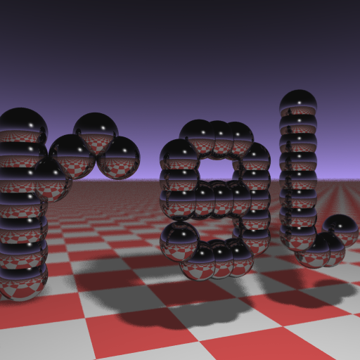

# The Business Card Ray Tracer

This is a more readable adaptation of Andrew "aek" Kensler's original
1337-size ray tracer written in plan 9 C.

You can read an updated version of his
[here](http://eastfarthing.com/blog/2016-01-12-card/).

I also recommend you take a look at Paul Heckbert's “A Minimal Ray
Tracer”, Graphics Gems IV.
